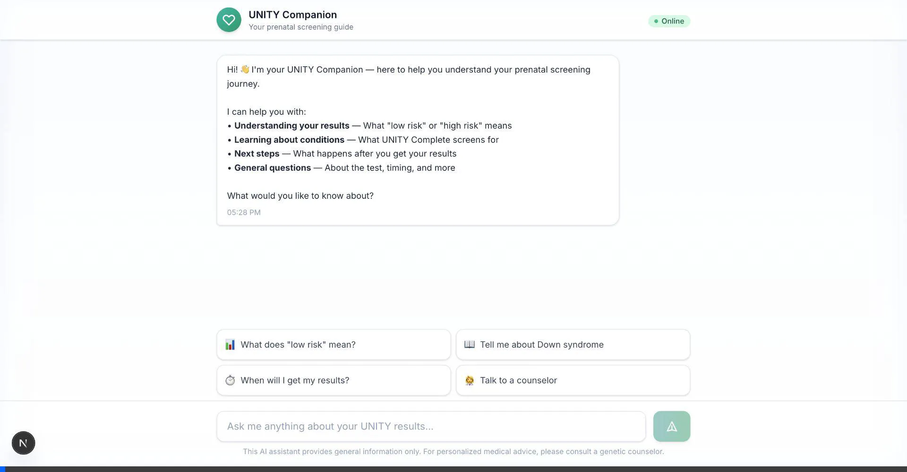

# UNITY Companion - AI Patient Results Assistant

An AI-powered chatbot that helps patients understand their UNITY Complete prenatal screening results.

**Built for [BillionToOne](https://www.billiontoone.com)** to demonstrate AI engineering capabilities.



---

## 🎯 Problem Solved

| Pain Point | Solution |
|------------|----------|
| Patients wait 1-2 weeks for results with anxiety | 24/7 AI companion for support |
| Genetic counselors overloaded with repetitive questions | AI handles common queries |
| Medical terminology confuses patients | Plain-language explanations |

---

## 🏗️ Architecture

```
┌─────────────────┐      ┌─────────────────┐      ┌─────────────────┐
│   Next.js       │      │   FastAPI       │      │   Gemini API    │
│   Frontend      │ ───► │   Backend       │ ───► │   (LLM)         │
│   (Port 3000)   │      │   (Port 8000)   │      │                 │
└─────────────────┘      └─────────────────┘      └─────────────────┘
                               │
                               ▼
                         ┌─────────────────┐
                         │  RAG Knowledge  │
                         │  Base (JSON)    │
                         └─────────────────┘
```

---

## 🚀 Quick Start

### 1. Backend (Python)
```bash
cd unity-companion-backend
pip install -r requirements.txt
echo "GEMINI_API_KEY=your_key" > .env
uvicorn main:app --reload --port 8000
```

### 2. Frontend (Next.js)
```bash
cd unity-companion
npm install
npm run dev
```

### 3. Open http://localhost:3000

---

## 📁 Project Structure

```
BillionToOne/
├── unity-companion-backend/     # Python FastAPI Backend
│   ├── main.py                  # API server
│   ├── core/
│   │   ├── rag.py               # RAG retrieval + generation
│   │   ├── prompt.py            # System prompts
│   │   └── safety.py            # Safety guardrails
│   ├── knowledge/
│   │   └── conditions.json      # Medical knowledge base
│   └── models/
│       └── schemas.py           # Pydantic models
│
└── unity-companion/             # Next.js Frontend
    ├── app/
    │   └── page.tsx             # Main page
    └── components/
        └── ChatInterface.tsx    # Chat UI component
```

---

## 🧠 AI Features

| Feature | Description |
|---------|-------------|
| **RAG System** | Retrieves relevant condition info from knowledge base |
| **Safety Guardrails** | Blocks unsafe medical advice, adds disclaimers |
| **Escalation Detection** | Identifies distress → recommends genetic counselor |
| **Fallback Responses** | Works even without API key |

---

## 🔒 Safety Guardrails

- **Blocked phrases**: Prevents definitive medical advice ("you should terminate", "your baby will have")
- **Auto-disclaimers**: Adds genetic counselor recommendations to medical responses
- **Escalation triggers**: Detects anxiety/distress and recommends human support
- **No diagnosis**: Never provides diagnoses, only educational information

---

## 📊 Conditions Covered

- Down Syndrome (Trisomy 21)
- Edwards Syndrome (Trisomy 18)
- Patau Syndrome (Trisomy 13)
- Cystic Fibrosis
- Sickle Cell Disease
- Spinal Muscular Atrophy

---

## 🛠️ Tech Stack

| Layer | Technology |
|-------|------------|
| Frontend | Next.js 14, TypeScript, Tailwind CSS |
| Backend | Python, FastAPI, Pydantic |
| AI/LLM | Google Gemini 2.5 Flash |
| Architecture | RAG (Retrieval-Augmented Generation) |

---

## 👨‍💻 Built By

**Deep Sheth** - AI Engineer

Demonstrating:
- Full-stack development (Python + TypeScript)
- LLM integration (Gemini API)
- RAG architecture for healthcare
- AI safety considerations for medical applications

---

*This is a demonstration project. For real medical advice, consult a healthcare provider.*
